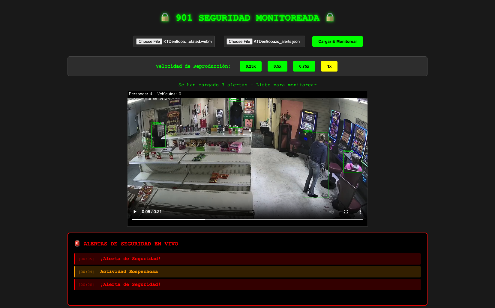

# 🔒 Sistema Inteligente de Control de Seguridad

Este sistema inteligente de control de seguridad combina análisis de visión computacional con contexto operativo para alertar sobre actividades sospechosas en material de videovigilancia, puede usarse con cualquier video de YouTube.



## 🎯 Características Principales

- **Detección automática de objetos** usando YOLOv8 para identificar personas y vehículos
- **Alertas configurables** basadas en umbrales de personas y vehículos
- **Detección de interacciones** entre objetos detectados
- **Procesamiento optimizado** con omisión configurable de frames para rendimiento en cuasi-tiempo real
- **Interfaz web interactiva** para monitoreo en vivo con alertas sincronizadas
- **Pipeline completo de datos** desde descarga hasta visualización anotada

## 🛠️ Tecnologías Utilizadas

- **Python 3.11** - Lenguaje principal
- **YOLOv8 (Ultralytics)** - Modelo de detección de objetos
- **OpenCV** - Procesamiento de video
- **yt-dlp** - Descarga de videos de YouTube
- **HTML/CSS/JavaScript** - Interfaz web de monitoreo
- **JSON** - Almacenamiento de anotaciones y alertas

## 📋 Requisitos

- Python 3.11
- uv (gestor de paquetes)

## 🚀 Instalación

1. Clona el repositorio:
```bash
git clone <url-del-repositorio>
cd 901-sm
```

2. Inicializa el proyecto con uv:
```bash
uv init --name 901-sm --python 3.11 .
```

3. Instala las dependencias:
```bash
uv add "torch<2.3" opencv-python ultralytics yt-dlp flask flask-cors
```

## 📖 Uso del Sistema

### 1. Descarga de Video

Descarga un video de YouTube para análisis:

```bash
uv run python 01_download_video.py "https://youtube.com/watch?v={id_video}"
```

**Salida:** `downloads/{id_video}.webm`

### 2. Análisis de Seguridad

Procesa el video para detectar actividades sospechosas:

```bash
uv run python 02_process_video.py [id_video] [personas_max] [vehiculos_max] [omitir_frames]
```

**Parámetros:**
- `id_video`: ID del video descargado
- `personas_max`: Número máximo permitido de personas
- `vehiculos_max`: Número máximo permitido de vehículos  
- `omitir_frames`: (Opcional) Procesar cada N frames para mayor velocidad

**Ejemplo:**
```bash
# Procesar todos los frames, alertar si >2 personas o >1 vehículo
uv run python 02_process_video.py "KTDen9ooazo" 2 0

# Procesar cada 5to frame para mayor velocidad
uv run python 02_process_video.py "KTDen9ooazo" 2 0 5
```

**Salidas:** Estos archivos serán utilizados en la generación del video anotado y en el monitoreo en vivo respectivamente
- `annotations/{id_video}_annotations.json` - Anotaciones detalladas por frame
- `processed/{id_video}_alerts.json` - Alertas con timestamps

### 3. Anotación de Video

Genera video anotado con detecciones visuales:

```bash
uv run python 03_annotate_video.py [id_video]
```

**Salida:** `processed/{id_video}_annotated.webm`, el archivo se usa durante el monitoreo en vivo.

### 4. Limpieza de Alertas

Elimina alertas duplicadas y prioriza por segundo:

```bash
uv run python 04_clean_alerts.py [id_video]
```

**Prioridad de alertas:**
1. 🔴 **¡Alerta de Seguridad!** - Máxima prioridad
2. 🟡 **Actividad Sospechosa** - Prioridad media  
3. 🟢 **Todo OK** - Situación normal

### 5. Visualización Interactiva

Abre `index.html` en Chrome para:
- Cargar video anotado y alertas JSON
- Ver alertas en tiempo real sincronizadas
- Controlar velocidad de reproducción (0.25x, 0.5x, 0.75x, 1x)
- Monitorear como un sistema de seguridad profesional

## 📁 Estructura del Proyecto

```
901-sm/
├── annotations/               # Directorio con anotaciones de videos en formato JSON
├── downloads/                 # Directorio con videos descargados en formato WEBM
├── processed/                 # Directorio con videos anotados en formato WEBM y sus alertas en formato JSON
├── website/                   # Directorio de la interfaz web
├── 01_download_video.py       # Script para descargar de YouTube
├── 02_process_video.py        # Script de análisis de seguridad con YOLO
├── 03_annotate_video.py       # Script para generación de video anotado
└── 04_clean_alerts.py         # Script de limpieza y priorización de alertas
```

## 🎨 Tipos de Alertas

- **🟢 Todo OK** - Situación normal, conteos dentro de límites
- **🟡 Actividad Sospechosa** - Exceso de personas o vehículos detectados
- **🔴 ¡Alerta de Seguridad!** - Interacciones detectadas entre personas y vehículos

## ⚡ Optimización de Rendimiento

- **Omisión de frames**: Procesar cada N frames para mayor velocidad
- **Modelos YOLO**: Cambiar entre yolov8n.pt (rápido) y yolov8s.pt (preciso)
- **Limpieza de alertas**: Eliminar duplicados y priorizar por importancia

## 🔧 Configuración Avanzada

### Cambiar Modelo YOLO

En `analyze_security.py`, modifica:
```python
model = YOLO("yolov8s.pt")  # Más preciso pero más lento
model = YOLO("yolov8n.pt")  # Más rápido pero menos preciso
```

### Ajustar Clases de Vehículos

Modifica las clases de vehículos detectadas:
```python
vehicle_classes = [1, 2, 3, 5, 6, 7, 8]  # bicicleta, auto, moto, bus, tren, camión, bote
```

### Umbral de Interacción

Ajusta la distancia para detectar interacciones:
```python
interactions = detect_interactions(people_boxes, vehicle_boxes, threshold=50)
```

## 🎯 Casos de Uso

- **Monitoreo de seguridad** a partir de videovigilancia
- **Análisis de tráfico** y conteo de vehículos
- **Control de acceso** por número de personas
- **Detección de comportamientos** sospechosos
- **Sistemas IoT** de videovigilancia

## 📊 Métricas de Rendimiento

- **YOLOv8n**: ~15-20 FPS, menor precisión
- **YOLOv8s**: ~8-12 FPS, mayor precisión
- **Omisión de frames**: Hasta 5x más rápido con skip_frames=5

## 🤝 Contribución y Trabajo Futuro

- El objetivo principal de este proyecto es demostrar la viabilidad de esta tecnología para realizar monitoreo en tiempo real, alertando a usuarios sobre posibles brechas de seguridad de forma inmediata. Sería interesante aplicarlo en sistemas de monitoreo reales.
- Dentro del alcance de este proyecto, no se explotó la capacidad del modelo para detectar diversos objetos (sillas, TVs, etc.), sería interesante implementar casos de alerta relacionados con ellos.
- Más allá de la selección del modelo y la omisión de frames, sería muy interesante reescribir el script de procesamiento con una función de Python que esté acelerada por un lenguaje de bajo nivel, como Rust, teóricamente aceleraría considerablemente la velocidad de procesamiento.

***

Proyecto desarrollado para demostración de capacidades técnicas en sistemas inteligentes de control con contexto operativo, análisis situacional y visión en tiempo real para tomar decisiones automáticas. Quedo atento por cualquier consulta.

Mauricio Barbieri <br>
*Data Engineer & Python Developer* <br>
mbarbierif@gmail.com <br>
+54 221 6552307